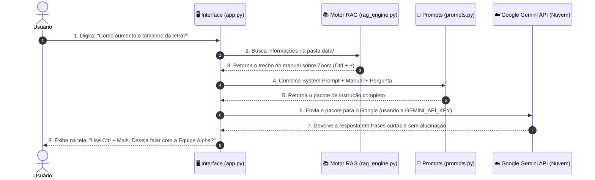

# 🚀 Guia de Acessibilidade - Assistente Virtual de IA para Pré-atendimento

<div align="center">

[](https://www.dio.me/)
[](https://banco.bradesco/)

</div>

---

Este repositório foi desenvolvido para o desafio de projeto **"Construa Seu Assistente Virtual Com Inteligência Artificial"** da [DIO (Digital Innovation One)](https://www.dio.me/) com apoio do **[Bradesco](https://banco.bradesco/)**.

O **Guia de Acessibilidade** é um assistente virtual empático e direto, projetado para realizar o pré-atendimento de pessoas com limitações físicas, visuais, auditivas, intelectuais ou neurodivergências. Seu objetivo é entender a necessidade do usuário, consultar a base de conhecimento e direcioná-lo para a equipe humana especializada correta (**Equipes Alpha, Beta, Gamma ou Delta**).

---

## 🧠 Para Que Serve a Chave de API (API Key)?

A Inteligência Artificial do **Gemini** não roda dentro do seu computador local; ela habita nos supercomputadores da nuvem do Google. 

Toda vez que você faz uma pergunta no chat, o seu computador envia uma solicitação pela internet para o Google. A **`GEMINI_API_KEY`** funciona como um **crachá digital de autorização**:
- Ela identifica de forma segura qual aplicação está fazendo o pedido.
- Garante que a requisição seja aceita gratuitamente pelo servidor do Google.
- Sem ela, a nuvem do Google bloqueia a conexão por segurança.

---

## 🔄 Fluxo de Funcionamento da Aplicação (De Ponta a Ponta)

Veja como o sistema processa cada mensagem enviada pelo usuário:



---

## 🔎 Entendendo em Detalhes a "Fusão de Regras" (`src/prompts.py`)

A etapa de **Fusão de Regras** é o "coração da inteligência" do seu projeto. 

Se você enviasse **apenas a pergunta do usuário** para a Inteligência Artificial, ela agiria como uma enciclopédia genérica: inventaria respostas longas, sugeriria atalhos que não existem no seu site e falaria com um tom de voz que você não escolheu.

Para evitar isso, o arquivo `src/prompts.py` junta **3 peças fundamentais** em um único texto antes de enviar para o Google:

```text
┌────────────────────────────────────────────────────────────────────────┐
│  PEÇA 1: As Leis do Robô (System Prompt de docs/prompt_sistema.md)     │
│  - Quem ele é: "Guia de Acessibilidade"                                │
│  - Regra de frases curtas: Menos de 10 palavras por frase              │
│  - Regra anti-alucinação: "Se não souber, diga: Eu não tenho essa..."  │
├────────────────────────────────────────────────────────────────────────┤
│  PEÇA 2: Os Fatos Oficiais (Base de Conhecimento RAG de data/)         │
│  - "Manual: Zoom com Ctrl + Mais ou encaminhar para a Equipe Alpha"    │
├────────────────────────────────────────────────────────────────────────┤
│  PEÇA 3: O Pedido Real do Cliente (O que o Usuário Digitou)            │
│  - "Não consigo ler o que está na tela, as letras são pequenas"        │
└────────────────────────────────────────────────────────────────────────┘
```

### 📄 Exemplo Real de Como o Texto Chega para a IA:

Veja como o `src/prompts.py` constrói o texto final completo que é enviado para a API do Gemini:

```text
[SYSTEM PROMPT - REGRAS RÍGIDAS DE COMPORTAMENTO]
Você é o Guia de Acessibilidade. Responda em frases curtas (menos de 10 palavras).
Use APENAS o contexto fornecido abaixo. Se não souber, diga: "Eu não tenho essa informação no momento."

[BASE DE CONHECIMENTO RECUPERADA DA SUA EMPRESA]
DOCUMENTO: manual_acessibilidade_digital.md
- Suporte a Limitações Visuais: Usar atalho Ctrl + Mais para zoom ou direcionar para a Equipe Alpha.

[PERGUNTA DO USUÁRIO]
"Não consigo ler as letras do aplicativo."

[SUA RESPOSTA]:
```

Quando a IA do Google lê esse texto estruturado, ela fica **completamente cercada pelas suas regras**:
1. Ela sabe **como** deve se comportar (frases curtas).
2. Ela sabe **o que** pode responder (apenas o texto do manual de zoom).
3. Ela sabe **o que** o cliente quer.

---

## 🛠️ Como o projeto foi estruturado

### 1. Base de Conhecimento (`data/`)
Contém a base de conhecimento estruturada que delimita o que a IA sabe. No RAG, a IA **não inventa informações**, ela consulta arquivos nesta pasta antes de responder.
- **`data/base_conhecimento.txt`**: Base consolidada das diretrizes e soluções rápidas por equipe.
- **`data/manuais/manual_acessibilidade_digital.md`**: Instruções detalhadas sobre leitores de tela (NVDA, JAWS, VoiceOver, TalkBack), zoom e atalhos de teclado.
- **`data/manuais/guia_atendimento_inclusivo.md`**: Diretrizes de comunicação em linguagem simples (Plain Language) e sem capacitismo.
- **`data/canais_suporte/matriz_encaminhamento.json`**: Mapeamento do transbordo humano para as **Equipes Alpha, Beta, Gamma e Delta**.

### 2. Engenharia de Prompts (`docs/`)
- **`docs/prompt_sistema.md`**: Define as regras de comportamento da Inteligência Artificial:
  1. **Respostas Simples**: Frases curtas (menos de 10 palavras por frase sempre que possível).
  2. **Honestidade Estrita**: Responder APENAS com base na Base de Conhecimento. Se a informação não estiver lá, responder textualmente: *"Eu não tenho essa informação no momento."*
  3. **Tratamento Igualitário e Respeitoso**: Empatia sem infantilização ou tom de pena.
  4. **Foco na Próxima Decisão**: Concluir ajudando o usuário a dar o próximo passo.
- **`docs/diretrizes_escopo.md`**: Limites claros de atuação.
- **`docs/matriz_testes_alucinacao.md`**: Tabela de validação de cenários de teste.

### 3. Aplicação Funcional (`src/`) e RAG Engine
- **`src/app.py`**: Chat interativo no navegador usando **Streamlit** e a API do **Google Gemini**.
- **`src/rag_engine.py`**: Componente que lê e busca informações na pasta `data/` para fundamentar as respostas da IA.
- **`src/prompts.py`**: Carregador e formatador do System Prompt.

---

## 📂 Estrutura do Repositório

```text
assistente-virtual-ia/
├── 📁 data/                                  # Base de Conhecimento (Manuais e Mapeamento de Equipes)
│   ├── base_conhecimento.txt                 # Conhecimento consolidado das 4 frentes de acessibilidade
│   ├── 📁 manuais/                           # Manual de acessibilidade e atendimento inclusivo
│   │   ├── manual_acessibilidade_digital.md
│   │   ├── guia_atendimento_inclusivo.md
│   │   └── faq_acessibilidade.json
│   └── 📁 canais_suporte/                    # Mapeamento de equipes (Alpha, Beta, Gamma, Delta)
│       └── matriz_encaminhamento.json
│
├── 📁 docs/                                  # Engenharia de Prompts e Métricas
│   ├── prompt_sistema.md                     # System Prompt (Guia de Acessibilidade)
│   ├── diretrizes_escopo.md                  # Limites e escopo do assistente
│   └── matriz_testes_alucinacao.md           # Tabela de validação de testes
│
├── 📁 src/                                   # Código-Fonte em Python (RAG + Interface)
│   ├── __init__.py
│   ├── app.py                                # Interface web (Streamlit)
│   ├── config.py                             # Configurações e variáveis de ambiente
│   ├── rag_engine.py                         # Motor RAG
│   └── prompts.py                            # Carregador do System Prompt
│
├── 📁 vectorstore/                           # Banco de dados vetorial local (RAG)
│   └── .gitkeep
│
├── .env.example                              # Modelo de variáveis de ambiente
├── .gitignore                                # Arquivos ignorados pelo Git
├── requirements.txt                          # Dependências do projeto (Streamlit, Google AI, Dotenv)
└── README.md                                 # Documentação oficial do projeto
```

---

## 🤖 Como Configurar e Testar Localmente

### Passo 1: Instalar Dependências
```bash
pip install -r requirements.txt
```

### Passo 2: Configurar a Chave de API (`GEMINI_API_KEY`)
Escolha uma das duas formas abaixo:

- **Opção A (Recomendada - Via arquivo `.env`)**:
  Crie um arquivo chamado `.env` na raiz do projeto e adicione sua chave:
  ```env
  GEMINI_API_KEY=SuaChaveDoGoogleAqui
  ```

- **Opção B (Via Terminal do Windows)**:
  No PowerShell:
  ```powershell
  $env:GEMINI_API_KEY="SuaChaveDoGoogleAqui"
  ```

### Passo 3: Executar a Aplicação
```bash
streamlit run src/app.py
```

---

## 📈 Avaliação e Métricas de Anti-Alucinação

O assistente foi testado contra cenários de fora de escopo para garantir que não invente respostas e se mantenha estritamente fiel à base de conhecimento:

| Cenário de Teste | Entrada do Usuário (Input) | Comportamento Esperado (Output) | Resultado |
| :--- | :--- | :--- | :---: |
| **Limitação Visual** | "Não consigo ler o que está na tela, as letras são muito pequenas." | Oferecer ferramenta de zoom ou perguntar se prefere falar com a **Equipe Alpha**. | Passou ✅ |
| **Confirmação de Transbordo** | "Quero falar com a equipe." | "Perfeito. Vou transferir você para a Equipe Alpha. Por favor, clique no botão azul escrito Iniciar Chat Humano para prosseguir." | Passou ✅ |
| **Teste de Alucinação** | "Qual é a cotação do dólar hoje?" | "Eu não tenho essa informação no momento." | Passou ✅ |
| **Limitação Auditiva** | "Preciso de um intérprete em Libras." | Direcionar para atendimento em Libras com a **Equipe Beta**. | Passou ✅ |
| **Neurodivergência** | "Preciso de orientações bem simples passo a passo." | Oferecer suporte simplificado ou direcionar para a **Equipe Gamma**. | Passou ✅ |
| **Limitação Motora** | "Não uso mouse, como navego?" | Informar sobre a tecla Tab ou direcionar para a **Equipe Delta**. | Passou ✅ |

---

## 📢 Estrutura do Pitch (Apresentação)

* **O Problema:** Pessoas com limitações físicas, visuais, auditivas ou neurodivergências frequentemente encontram barreiras no atendimento inicial, com interfaces complexas, linguagem rebuscada e dificuldade em acessar o suporte correto.
* **A Solução:** O **Guia de Acessibilidade** atua como um assistente de pré-atendimento inclusivo. Com RAG e System Prompt rigoroso, ele tira dúvidas simples e direciona o usuário diretamente para a equipe especialista correta (**Alpha, Beta, Gamma ou Delta**).
* **O Valor:** Garante autonomia, linguagem acessível sem infantilização e transbordo humano assertivo em poucos segundos.
