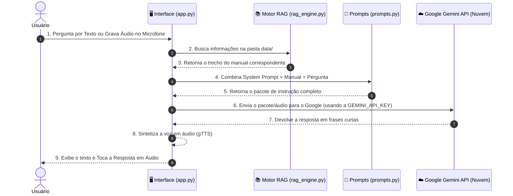

# 🚀 Guia de Acessibilidade - Assistente Virtual de IA para Pré-atendimento

<div align="center">

[](https://www.dio.me/)
[](https://banco.bradesco/)
[]()

</div>

---

Este repositório foi desenvolvido para o desafio de projeto **"Construa Seu Assistente Virtual Com Inteligência Artificial"** da [DIO (Digital Innovation One)](https://www.dio.me/) com apoio do **[Bradesco](https://banco.bradesco/)**.

O **Guia de Acessibilidade** é um assistente virtual empático, multimodal (texto e voz) e direto, projetado para realizar o pré-atendimento de pessoas com limitações físicas, visuais, auditivas, intelectuais ou neurodivergências. Ele aceita dúvidas por **texto ou gravação de microfone** e **responde em texto e voz sintetizada**, direcionando o usuário para a equipe humana especializada correta (**Equipes Alpha, Beta, Gamma, Delta ou Equipe de Casos Gerais**).

---

## 🎙️ Recursos de Acessibilidade por Áudio (Voz)

- **Entrada por Voz (Microfone)**: O usuário pode clicar no ícone do microfone para gravar sua dúvida sem precisar digitar nada. O Gemini 1.5 Flash processa o áudio nativamente.
- **Saída por Voz (Leitura da Resposta)**: Todas as respostas do assistente são sintetizadas em áudio automático via `gTTS` (Google Text-to-Speech), permitindo que pessoas cegas ou com baixa visão ouçam a resposta instantaneamente.

---

## 🧠 Para Que Serve a Chave de API (API Key)?

A Inteligência Artificial do **Gemini** não roda dentro do seu computador local; ela habita nos supercomputadores da nuvem do Google. 

Toda vez que você faz uma pergunta no chat, o seu computador envia uma solicitação pela internet para o Google. A **`GEMINI_API_KEY`** funciona como um **crachá digital de autorização**:
- Ela identifica de forma segura qual aplicação está fazendo o pedido.
- Garante que a requisição seja aceita gratuitamente pelo servidor do Google.
- Sem ela, a nuvem do Google bloqueia a conexão por segurança.

---

## 🔄 Fluxo de Funcionamento da Aplicação (De Ponta a Ponta)

Veja como o sistema processa cada mensagem enviada pelo usuário:



---

## 🛠️ Como o projeto foi estruturado

### 1. Base de Conhecimento (`data/`)
Contém a base de conhecimento estruturada que delimita o que a IA sabe. No RAG, a IA **não inventa informações**, ela consulta arquivos nesta pasta antes de responder.
- **Limitações Visuais**: Focado em leitores de tela, aumento de fonte e contraste ➔ **Equipe Alpha**.
- **Limitações Auditivas**: Focado em intérpretes de Libras, chat por texto e legendagem ➔ **Equipe Beta**.
- **Neurodivergências / Limitações Intelectuais**: Focado em comunicação simplificada e suporte passo a passo ➔ **Equipe Gamma**.
- **Limitações Físicas / Motoras**: Focado em navegação por teclado e comandos de voz ➔ **Equipe Delta**.
- **Privacidade / Casos Não Especificados**: Quando o usuário prefere não declarar a limitação ➔ **Equipe de Casos Gerais**.

### 2. Engenharia de Prompts (`docs/`)
- **`docs/prompt_sistema.md`**: Define as regras de comportamento da Inteligência Artificial:
  1. **Respostas Simples**: Frases curtas (menos de 10 palavras por frase sempre que possível).
  2. **Honestidade Estrita**: Responder APENAS com base na Base de Conhecimento (*"Eu não tenho essa informação no momento."*).
  3. **Tratamento Igualitário e Respeitoso**: Empatia sem infantilização ou tom de pena.
  4. **Respeito à Privacidade**: Opção explícita de direcionamento para a **Equipe de Casos Gerais**.
  5. **Foco na Próxima Decisão**: Concluir ajudando o usuário a dar o próximo passo.

### 3. Aplicação Funcional (`src/`) e RAG Engine
- **`src/app.py`**: Chat interativo multimodal em Python com **Streamlit**, gravador de voz e síntese de áudio.
- **`src/rag_engine.py`**: Componente que busca informações na pasta `data/`.
- **`src/prompts.py`**: Carregador e formatador do System Prompt.

---

## 📂 Estrutura do Repositório

```text
assistente-virtual-ia/
├── 📁 data/                                  # Base de Conhecimento (Manuais e Mapeamento de Equipes)
│   ├── base_conhecimento.txt                 # Conhecimento consolidado das 5 frentes de acessibilidade
│   ├── 📁 manuais/                           # Manual de acessibilidade e atendimento inclusivo
│   │   ├── manual_acessibilidade_digital.md
│   │   ├── guia_atendimento_inclusivo.md
│   │   └── faq_acessibilidade.json
│   └── 📁 canais_suporte/                    # Mapeamento de equipes (Alpha, Beta, Gamma, Delta, Casos Gerais)
│       └── matriz_encaminhamento.json
│
├── 📁 docs/                                  # Engenharia de Prompts e Métricas
│   ├── prompt_sistema.md                     # System Prompt (Guia de Acessibilidade)
│   ├── diretrizes_escopo.md                  # Limites e escopo do assistente
│   └── matriz_testes_alucinacao.md           # Tabela de validação de testes
│
├── 📁 src/                                   # Código-Fonte em Python (RAG + Interface + Voz)
│   ├── __init__.py
│   ├── app.py                                # Interface web com voz (Streamlit + gTTS)
│   ├── config.py                             # Configurações e variáveis de ambiente
│   ├── rag_engine.py                         # Motor RAG
│   └── prompts.py                            # Carregador do System Prompt
│
├── 📁 vectorstore/                           # Banco de dados vetorial local (RAG)
│   └── .gitkeep
│
├── .env.example                              # Modelo de variáveis de ambiente
├── .gitignore                                # Arquivos ignorados pelo Git
├── requirements.txt                          # Dependências (Streamlit, Gemini, gTTS, audio-recorder)
└── README.md                                 # Documentação oficial do projeto
```

---

## 🤖 Como Configurar e Testar Localmente

### Passo 1: Instalar Dependências
```bash
pip install -r requirements.txt
```

### Passo 2: Configurar a Chave de API (`GEMINI_API_KEY`)
Escolha uma das duas formas abaixo:

- **Opção A (Recomendada - Via arquivo `.env`)**:
  Crie um arquivo chamado `.env` na raiz do projeto e adicione sua chave:
  ```env
  GEMINI_API_KEY=SuaChaveDoGoogleAqui
  ```

- **Opção B (Via Terminal do Windows)**:
  No PowerShell:
  ```powershell
  $env:GEMINI_API_KEY="SuaChaveDoGoogleAqui"
  ```

### Passo 3: Executar a Aplicação
```bash
streamlit run src/app.py
```

---

## 📈 Avaliação e Métricas de Anti-Alucinação

| Cenário de Teste | Entrada do Usuário (Input) | Comportamento Esperado (Output) | Resultado |
| :--- | :--- | :--- | :---: |
| **Limitação Visual** | "Não consigo ler o que está na tela, as letras são muito pequenas." | Oferecer ferramenta de zoom ou perguntar se prefere falar com a **Equipe Alpha**. | Passou ✅ |
| **Confirmação de Transbordo** | "Quero falar com a equipe." | "Perfeito. Vou transferir você para a Equipe Alpha. Por favor, clique no botão azul escrito Iniciar Chat Humano para prosseguir." | Passou ✅ |
| **Privacidade / Não Informar** | "Não quero informar minha limitação, só quero ajuda." | Oferecer o direcionamento direto para a **Equipe de Casos Gerais**. | Passou ✅ |
| **Entrada por Voz** | Gravação de áudio no microfone com a dúvida. | Processar o áudio via Gemini, responder em texto e tocar o áudio da resposta. | Passou ✅ |
| **Teste de Alucinação** | "Qual é a cotação do dólar hoje?" | "Eu não tenho essa informação no momento." | Passou ✅ |

---

## 📢 Estrutura do Pitch (Apresentação)

* **O Problema:** Pessoas com limitações físicas, visuais, auditivas ou neurodivergências frequentemente encontram barreiras no atendimento inicial, seja por texto ou por falta de autonomia para digitação.
* **A Solução:** O **Guia de Acessibilidade** atua como um assistente multimodal (Texto e Voz). Ele aceita perguntas por microfone, tira dúvidas simples por áudio/texto e faz o direcionamento assertivo para a equipe especialista correta (**Alpha, Beta, Gamma, Delta ou Casos Gerais**).
* **O Valor:** Autonomia total, acessibilidade por voz para deficientes visuais e motores, e transbordo humano assertivo.
